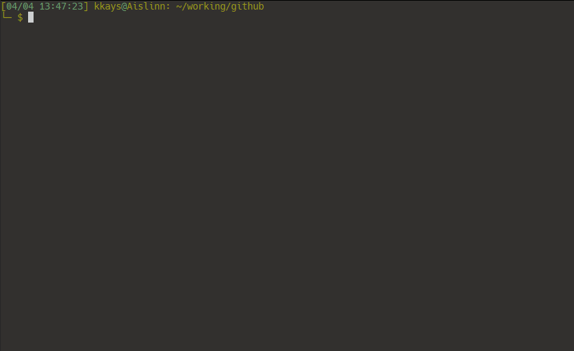
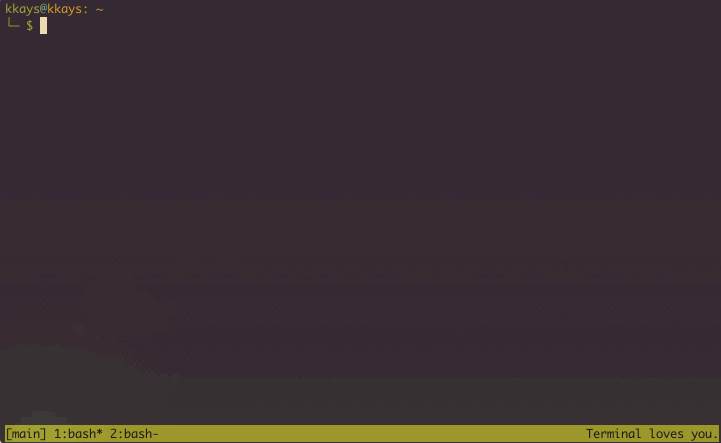

# Github Directory (ghd) [](https://circleci.com/gh/okkays/ghd) [](https://codecov.io/gh/okkays/ghd)

Utility to manage cloning and cd'ing to Github repos.



The idea behind this tool is to give an easy to access, centralized location for local clones of Github repositories.

## Dependencies

- For `ghd` and `ghd <ambiguous term>`, you'll want [fzf](https://github.com/fzf) in your `PATH`.

If you want to help with development, grab:

- [bats-core](https://github.com/bats-core/bats-core#installation) for testing
- [kcov](http://simonkagstrom.github.io/kcov/index.html) for coverage

## Installation

Put `ghd` somewhere in your `PATH`, then add:

```bash
alias ghd=". ghd"
```

to your bashrc. (Sourcing the script allows it to change directory.)

## Usage

```bash
ghd <repo_name or repo url (with https://github.com or git@github.com:)>
ghd <already cloned user, org, or repo name>
ghd /
ghd
```

For example, to clone and cd to this repo:

```bash
ghd okkays/ghd
```

To then `git pull --all` updates from and cd to that same repo:

```bash
ghd okkays/ghd!
# or
ghd ghd!
# or
ghd gh!<Enter>
```

To go to the root of your ghd-cloned repos:

```bash
ghd /
```

To use [fzf](https://github.com/junegunn/fzf) to search through your ghd-cloned repos:

```bash
ghd
```


If you've already checked out some of a user's repos, you can switch to that user's directory:

```bash
ghd okkays
```

Finally, to switch to the root of all of your cloned repos:

```bash
ghd
```

There, you can use directory-based tools like `find`, `ag`, etc to figure out where a piece of code is.



## Configuration

ghd reads the following environment variables:

- `GHD_LOCATION`: The directory in which to store repos (`/tmp/ghd` by default).
- `GHD_USE_SSH`: Whether to clone via ssh (uses https by default).
- `PAGER`: The pager to use for showing fzf preview results.

To configure them, add (for example):

```bash
export GHD_LOCATION="$HOME/.ghd"
export GHD_USE_SSH=1
```

to `~/.bashrc`

## Running tests

Just run:

```bash
bats ./test_ghd.sh
```

I recommend using [entr](http://eradman.com/entrproject/) for this:

```bash
ls | entr bats ./test_ghd.sh
```

To get coverage results, run:

```bash
kcov --include-path=. coverage bats ./test_ghd.sh
```

This will create a `coverage` folder with test coverage results.
