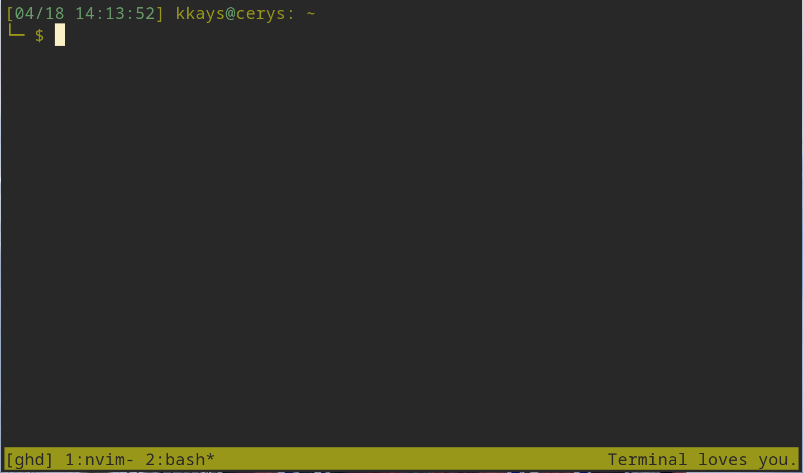

# Github Directory (ghd)
Utility to manage cloning and cd'ing to Github repos.


The idea behind this tool is to give an easy to access, centralized location for local clones of Github repositories.

For example, to clone and cd to this repo:

```bash
ghd okkays/ghd
```

If you've already checked out some of a user's repos, you can switch to that user's directory:

```bash
ghd okkays
```

Finally, to switch to the root of all of your cloned repos:

```bash
ghd
```

There, you can use directory-based tools like `find`, `ag`, etc to figure out where a piece of code is.


